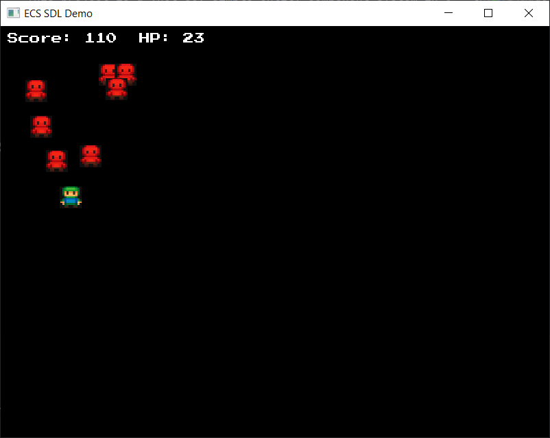

## Entity Component System

This project is a (not so) simple entity component system in C++ that I made 
to improve and show off my C++ and CMake skills.

Of particular interest is the utilization of C++ techniques such as 
**generics**, **templates**, **lambdas**, as well as 
the **Standard Template Library** (STL) and, of course, 
the **Simple DirectMedia Layer** (SDL).

🔹 **[Entity Component System](https://github.com/mido1236/portfolio/tree/master/ECS)**

### Screenshot
