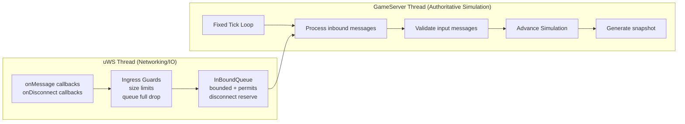

# Authoritative multiplayer football/soccer server

Hello and welcome to the football server! 
This is a multiplayer football server written in C++20 using the [uWebSockets](https://github.com/uNetworking/uWebSockets) library.

Features:
- Multiplayer
- Authoritative simulation
- Inbound message queue
- Websocket hub for incoming client connections
- Game server thread for processing inbound messages
- Ingress guards
- Snapshots
- Adapter pattern for unit tests
- ...and more!

## Architecture

